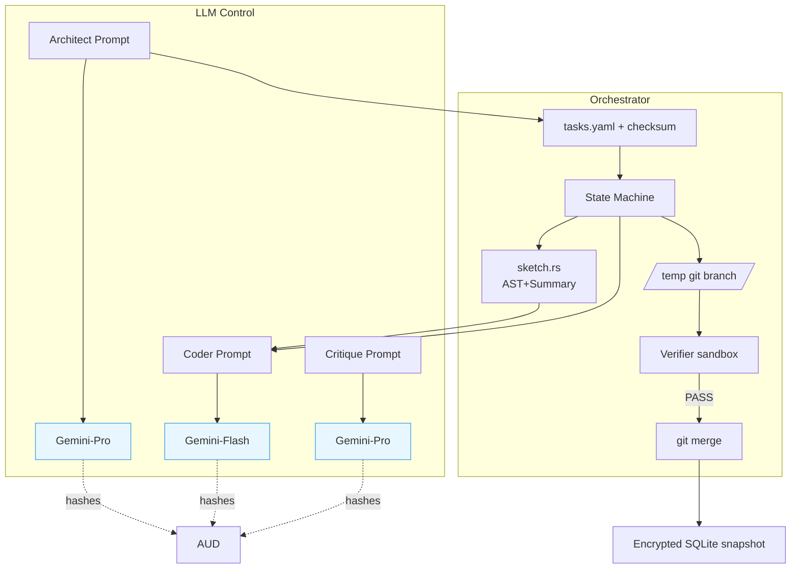

## 2ARCHITECTURE\_OVERVIEW\.md*(Snapshot – update each milestone)*

### Component Cheat‑Sheet

| Tag  | Component        | Language  | Key Libs                    | HotKPIs             |
| ---- | ---------------- | --------- | --------------------------- | -------------------- |
| ORC  | Orchestrator CLI | Rust      | `clap`, `tokio`             | Cmd latency p95      |
| SK  | `sketch.rs`      | Rust      | `tree‑sitter`, `tokenizers` | Context tokens 90p   |
| GOV  | ResourceGovernor | Rust      | `csv_async`, `rust_decimal` | Over‑budget aborts   |
| WASM | Verifier Sandbox | Rust/WASM | `wasmtime`, `cap-std`       | Sandbox escape 0     |
| AUD  | Audit Logger     | Rust      | `sha2`, `serde_json`        | Write‑failure aborts |

*Data flows, state diagrams, and ADR IDs live at **\`\`**.*